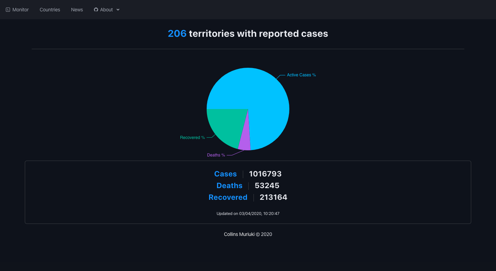

<h1 align="center">COVID-19 Monitor 🦠</h1>
<p>
  <a href="https://app.netlify.com/sites/covid19monitorapp/deploys" target="_blank">
    
  </a>
  
  <a href="LICENSE" target="_blank">
    
  </a>
  <a href="https://twitter.com/collinsmuriuki_" target="_blank">
    
  </a>
</p>



> View live updates on the COVID-19 situation in the world. API courtesy of [@NOVELCOVID](https://github.com/NovelCOVID/API). News articles fetched from the [News API](https://newsapi.org/).

### ✨ [Demo](https://covid19monitorapp.netlify.com/)

## Install

```sh
yarn
```

## Usage

```sh
yarn start
```

## Technologies Used
1. React.js
2. React redux
3. React router
4. React styled components
5. [Rsuite](https://rsuitejs.com/en/) ui library

## Author

👤 **collinsmuriuki**

* Website: https://muriuki.dev
* Twitter: [@collinsmuriuki_](https://twitter.com/collinsmuriuki_)
* Github: [@collinsmuriuki](https://github.com/collinsmuriuki)
* LinkedIn: [@collinsmuriuki](https://linkedin.com/in/collinsmuriuki)

## Show your support

Give a ⭐️ if this project helped you!

## 📝 License

Copyright © 2020 [collinsmuriuki](https://github.com/collinsmuriuki).<br />
This project is [MIT](LICENSE) licensed.